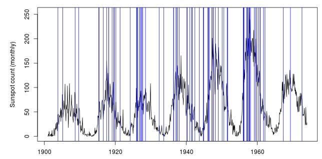

## Background

* Sunspot activity is correlated with the frequency of 'geomagnetic storms', disturbances caused by solar wind
   + Extreme storms, such as occurred in 1859 or 1921, come about every 100 years and could decimate the modern power grid [1,2]
* Visualizing these correlations can help us better understand them

[1] Kappenman, J. ['A perfect storm of planetary proportions.'](http://spectrum.ieee.org/energy/the-smarter-grid/a-perfect-storm-of-planetary-proportions) IEEE Spectrum.
[2] Behr, P. ['This week's solar flare illuminates the grid's vulnerability'.](http://www.nytimes.com/cwire/2011/06/09/09climatewire-this-weeks-solar-flare-illuminates-the-grids-63979.html) New York Times.

---

## The Solar Weather Explorer

* Lets user drag slider to visualize variation in sunspot activity for any range of years in the historical record
* Lets user check box to see when severe solar storms from 1859 to 2012 occurred

---

## The Solar Weather Explorer

* Graph labeling and tick marks automatically switch from years to months when intervals of 5 years or less are selected
* Calculates number of severe storms observed within selected date range

---

## The Solar Weather Explorer

* Calculates number of severe storms within selected date range
```{r}
#Example calculation -- severe storm count from 1900 to 1938
storms <- read.table("severestorms.txt", header=T)
storms$date <- storms$year + (storms$month - 1)/12
sum(storms$date >= 1900 & storms$date <= 1938)
```

---

## The Solar Weather Explorer

* Facilitates understanding of relationship between sunspot trends and storm frequency


